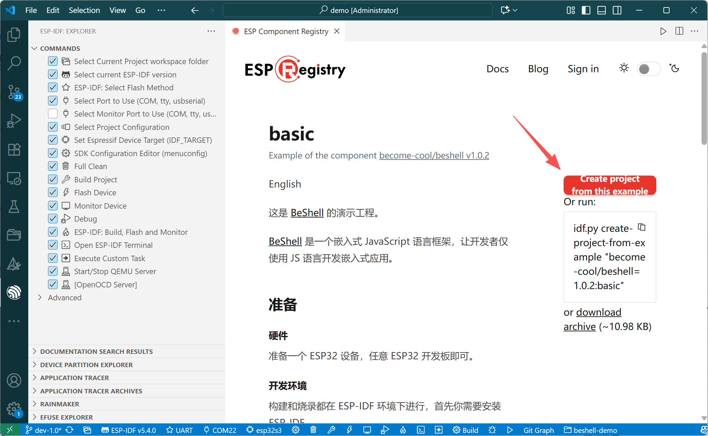

[BeShell](https://beshell.become.cool) Demo Project

[BeShell](https://beshell.become.cool) is an embedded JavaScript framework that allows developers to build embedded applications using only JavaScript.

## Preparation

#### Hardware

Prepare an ESP32 device; any ESP32 development board will work.

#### Development Environment

Building and flashing are done in the ESP-IDF environment. First, you need to install ESP-IDF.

* Install [ESP-IDF](https://docs.espressif.com/projects/esp-idf/en/v5.4.2/esp32/get-started/index.html) independently
* **Recommended:** Use the [ESP-IDF Extension](vscode:extension/espressif.esp-idf-extension) in VSCode.

## Creating an Example Project

Automatically create an example project from the ESP Component Registry in VSCode (requires the [ESP-IDF Extension](vscode:extension/espressif.esp-idf-extension)).

1. Press `Ctrl+Shift+P`, enter the keyword `component`, and select `ESP-IDF: Show ESP Component Registry`

	

2. Search for the component using the keyword `beshell`

	

3. Click the example `basic` to enter its page

	

4. Click `Create project from this example` on the page

	

5. Browse to the local directory where you want to store the project, and the [ESP-IDF Extension](vscode:extension/espressif.esp-idf-extension) in VSCode will automatically download the project and open it in a new window.

## Build and Flash

For the first build, simply run `idf.py build flash` to build and flash the entire project (with the device connected to your PC).

[BeShell](https://beshell.become.cool) supports allocating a separate partition on the device's flash to store JavaScript files, allowing you to execute and import these JS files just like on a PC.

The project's CMakeLists.txt provides commands for packaging and flashing JS files:

#### Packaging JS Scripts

Use the command `idf.py pack-js` to package all files in the `js` directory, generating a flashable image file `img/js.bin`.

> * When you run `idf.py build` to build the entire project, the JS packaging command is also executed automatically
> * The JS directory (`js`) and image file (`img/js.bin`) can be modified in CMakeLists.txt
> * If the target file already exists and none of the source files in the directory have changed, the command will not re-execute

#### Flashing JS Scripts

Use the command `idf.py flash-js` to flash the `img/js.bin` file to the JS partition on the device's flash.

The partition's start address can be modified in CMakeLists.txt. It should match the JS partition start address in partition.csv, and the size of `img/js.bin` must not exceed the JS partition.

> * When you run `idf.py flash` to flash the entire project, the JS partition flashing command is also executed automatically

## Running JavaScript Examples

The [BeShell](https://beshell.become.cool) firmware provides an interactive JS execution environment (`REPL`) that supports serial, websocket, Bluetooth, USB, and other forms. You can use any serial tool or the online console [BeConsole](https://beconsole.become.cool) to connect to an ESP32 device running BeShell firmware, then send commands or JS code to the firmware and receive program output and JS return values.

On startup, the firmware automatically runs `/main.js` from the JS partition (the path of the auto-start JS file can be modified in main.cpp).
Some JS examples are prepared in the `/example` directory. In a serial tool or [BeConsole](https://beconsole.become.cool), enter `run [path to JS file]`, e.g., `run /example/wifi-ap.js` to run the example. Enter `reboot` to return to the `/main.js` entry point.

## Online File System Access

After connecting to the device with [BeConsole](https://beconsole.become.cool), you can list, access, and manage JS files on the device. It also integrates the VSCode editor core to support online editing and real-time execution of JS files on the device. You can also package all JS files on the device into a zip file for download.
